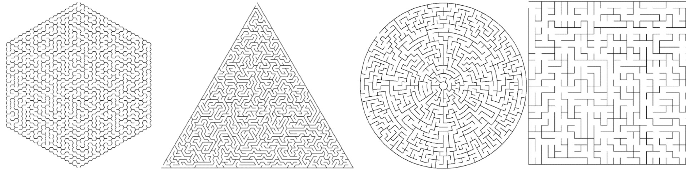

# Maze
A simplified approach to Maze Generation, Visualization and Solving using different algorithms.



## Quick Start
No installations required. Just clone this repository and run code

```bash
$ git clone https://github.com/emadehsan/maze

$ cd maze/src

# draw a rectangular maze
$ python rectangular.py

# or a circular one
$ python circular.py
```

## Current Mazes
* **Rectangular Maze** using Randomized Prim's Algorithm [ [tutorial](https://www.youtube.com/watch?v=d5yzKkG1n1U) ]
    
* **Circular Maze** using Depth First Search [ [tutorial](https://www.youtube.com/watch?v=q7t8UVlu-Fk) ]
    

