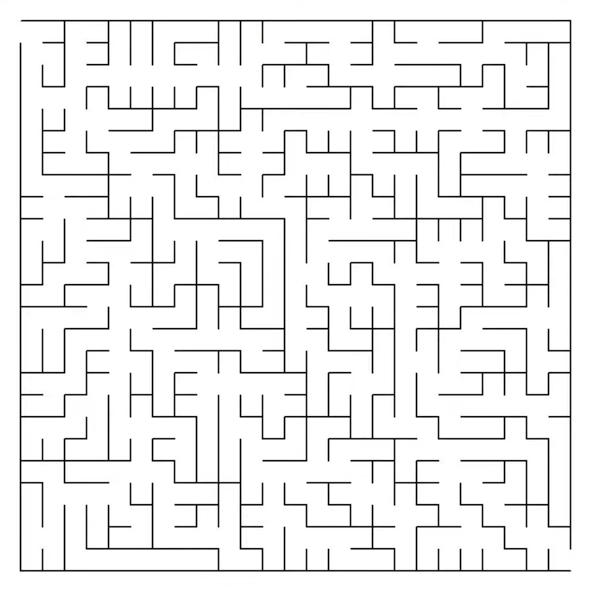
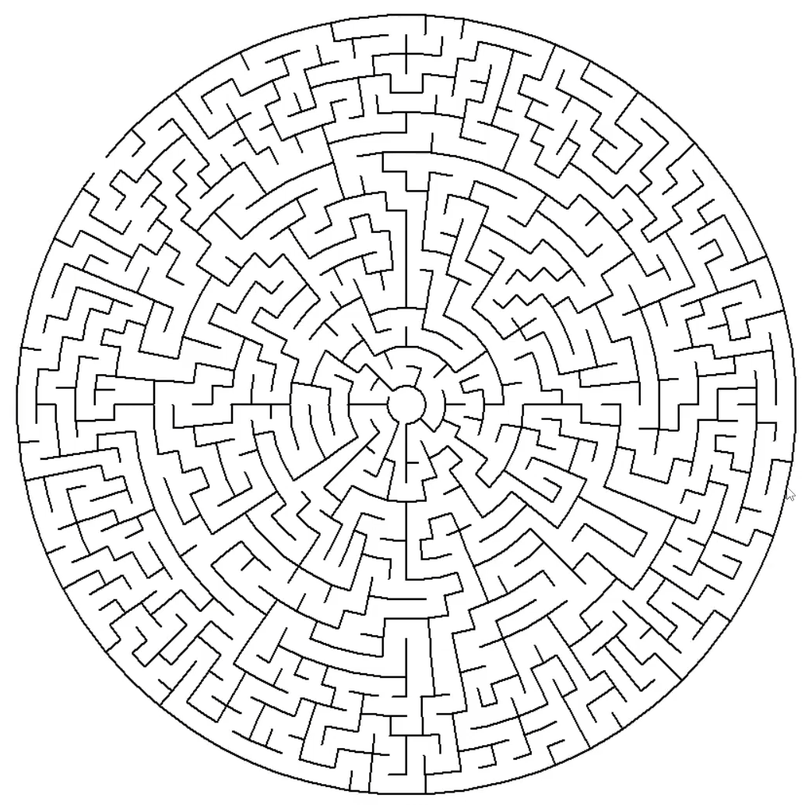
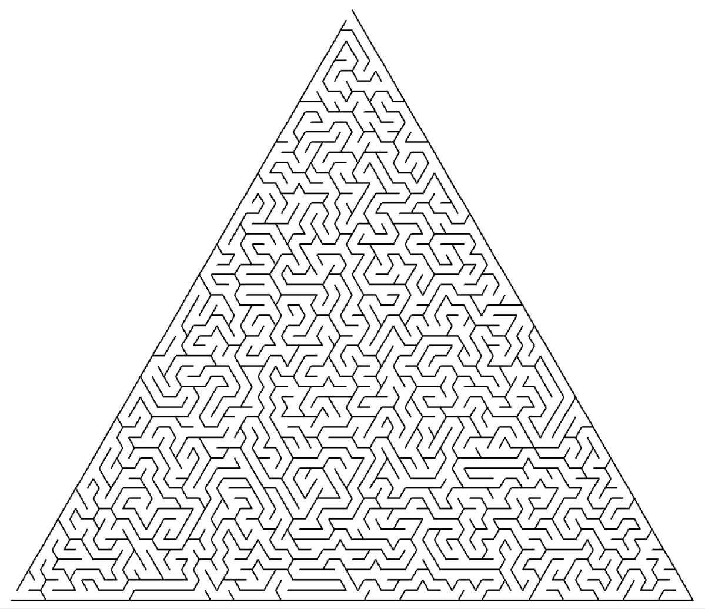
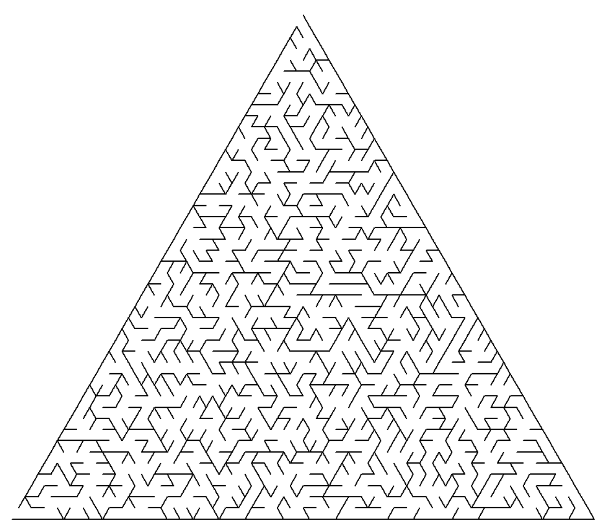
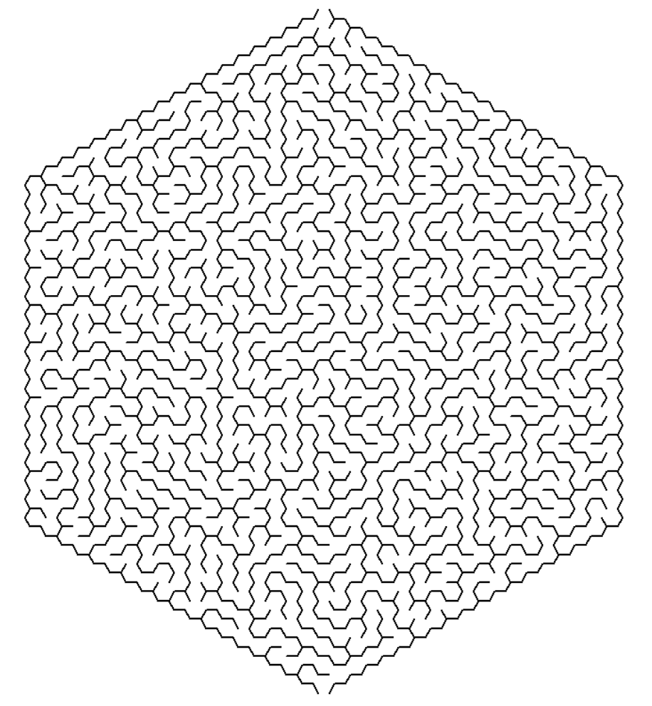

# Maze
Create Mazes of different types or generate Datasets to train your Maze GANs or Reinforcement Learning agents.
[Rectangular Maze Dataset](https://www.kaggle.com/datasets/emadehsan/rectangular-maze-kruskals-spanning-tree-algorithm) on Kaggle.


https://user-images.githubusercontent.com/7283624/183983986-626d8a34-1e45-40c2-af9a-79ddd010a31a.mp4


To understand how these Mazes are constructed, watch the accompanying [⏵︎video tutorials](https://www.youtube.com/watch?v=d5yzKkG1n1U&list=PLUNDATSEu7fiBiwCEkXr_ncDGYQMkoevr).

## Quick Start
No installations required. Just clone this repository and run code

```bash
$ git clone https://github.com/emadehsan/maze

$ cd maze/src

# draw a rectangular maze
$ python rectangular.py

# or a circular maze
$ python circular.py

# or a triangular maze
$ python triangular.py

# or a hexagonal maze
$ python hexagonal.py
```

## Generate Maze Dataset
You can also generate a dataset of Mazes. Right now, only Rectangular 
(actually Squared) Mazes are supported. 

Use the scripts in [`src/datasets`](src/datasets).

Example:

```bash
$ cd src/datasets/
$ python generate_rect_dataset.py -rows 10 -width 10 -items 1000
```

This will create a folder inside [`src/datasets`](src/datasets) with name
`rectangular_mazes_TIME`. The folder will contain 
* Mazes as `png` images
* `logs.txt` containing information about process (can be discarded) 
* `spanning_tree.txt` containing the Spanning Tree edges used to create the 
corresponding maze

Link to [Rectangular Maze Dataset](https://www.kaggle.com/datasets/emadehsan/rectangular-maze-kruskals-spanning-tree-algorithm) on Kaggle.


## Current Mazes
* **Rectangular Maze** using Randomized Prim's Algorithm [ [tutorial](https://www.youtube.com/watch?v=d5yzKkG1n1U) ]

    


* **Circular Maze** using Depth First Search [ [tutorial](https://www.youtube.com/watch?v=q7t8UVlu-Fk) ]
    
    

* **Triangular Maze** using Depth First Search

    

* **Triangular Maze** using Kruskal's Algorithm 
    
    

* **Hexagonal Maze** using Depth First Search 

    

## Note
* Please share your feedback by creating an issue or on Twitter
